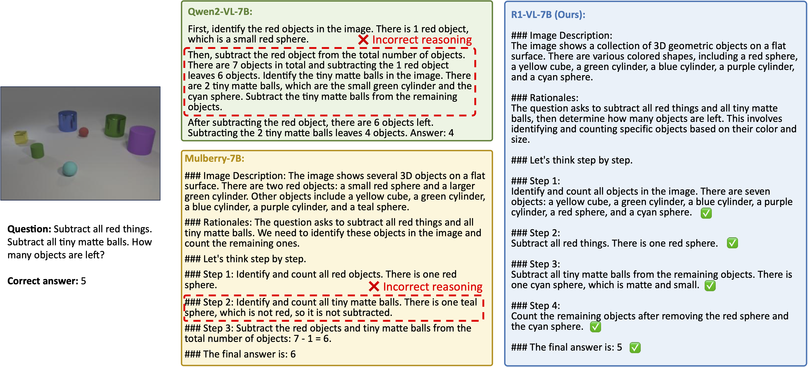

<div align="center">

<h1> R1-VL: Learning to Reason with Multimodal Large Language Models via Step-wise Group Relative Policy Optimization </h1>

<h5 align="center"> If you find this project useful, please give us a star🌟.

<h5 align="center"> 

<a href='https://arxiv.org/abs/2503.12937'></a>
<a href='https://huggingface.co/collections/jingyiZ00/r1-vl-67d8e2cbcbe40158b0a45e74'>
<a href='#'>

[Jingyi Zhang]()<sup>1</sup>,
[Jiaxing Huang](https://jxhuang0508.github.io/)<sup>1</sup>,
[Huanjin Yao](https://scholar.google.com/citations?user=pDtsCBQAAAAJ&hl=zh-CN)<sup>2</sup>,
[Shunyu Liu]()<sup>1</sup>,
[Xikun Zhang]()<sup>1</sup>,
[Shijian Lu]()<sup>1</sup>,
[Dacheng Tao]()<sup>1</sup>


<sup>1</sup>[Nanyang Technological University](https://www.ntu.edu.sg/), <sup>2</sup>[Tsinghua University](https://www.tsinghua.edu.cn/en/)


</h5>
</div>

## News
- [x] **`April 16, 2025.`** We release the training details for [SFT warm-up](https://github.com/jingyi0000/R1-VL?tab=readme-ov-file#sft-warm-up) stage. The code and training details for RL stage will be released soon!
- [x] **`March 22, 2025.`** We release our models [R1-VL-7B](https://huggingface.co/jingyiZ00/R1-VL-7B) and [R1-VL-2B](https://huggingface.co/jingyiZ00/R1-VL-2B).
- [x] **`March 17, 2025.`** We release our paper on [arxiv](https://arxiv.org/abs/2503.12937).

## Abstract
Recent studies generally enhance MLLMs' reasoning capabilities via supervised fine-tuning on high-quality chain-of-thought reasoning data, which often leads models to merely imitate successful reasoning paths without understanding what the wrong reasoning paths are.
In this work, we aim to enhance the MLLMs’ reasoning ability beyond passively imitating positive reasoning paths. 
To this end, we design Step-wise Group Relative Policy Optimization (StepGRPO), a new online reinforcement learning framework that enables MLLMs to self-improve reasoning ability via simple, effective and dense step-wise rewarding.
Specifically, StepGRPO introduces two novel rule-based reasoning rewards:
Step-wise Reasoning Accuracy Reward (StepRAR) and Step-wise Reasoning Validity Reward (StepRVR).
StepRAR rewards the reasoning paths that contain necessary intermediate reasoning steps via a soft key-step matching technique, while StepRAR rewards reasoning paths that follow a well-structured and logically consistent reasoning process through a reasoning completeness and logic evaluation strategy.
With the proposed StepGRPO, we introduce R1-VL, a series of MLLMs with outstanding capabilities in step-by-step reasoning.

<div align=center>

</div>

## Evaluation
We use [VLMEvalKit](https://github.com/open-compass/VLMEvalKit) to evaluate our models on different benchmarks. Here, we provide the evaluation instructions.

First, install VLMEvalKit according to the [official instructions](https://github.com/open-compass/VLMEvalKit/blob/main/docs/en/Quickstart.md).

Then, replace the necessary files with those in [this folder](https://github.com/jingyi0000/R1-VL/tree/main/eval).

Finally, perform evaluation via following command:
```bash
python run.py --data MathVista_MINI --model R1-VL-7B --verbose
```
For more evaluation options, please refer to [VLMEvalKit](https://github.com/open-compass/VLMEvalKit).

## Training

### SFT warm-up

#### Data Preparation
Download [Mulberry-260K](https://huggingface.co/datasets/HuanjinYao/Mulberry-SFT) and remove the reflective reasoning data.
#### Training
We use [LLaMA-Factory](https://github.com/hiyouga/LLaMA-Factory) to perform SFT warm-up:

First, install LLaMA-Factory according to the [official_instruction](https://github.com/hiyouga/LLaMA-Factory?tab=readme-ov-file#installation).

Then, refer to [here](https://github.com/hiyouga/LLaMA-Factory/blob/main/data/README.md) and update the following customized dataset into `dataset_info.json` in LLaMA-Factory.

```bash
"r1_vl_sft": {
    "file_name": "./mulberry_sft_wo_reflective_data.json",
    "formatting": "sharegpt",
    "columns": {
      "messages": "messages",
      "images": "images"
    },
    "tags": {
      "role_tag": "role",
      "content_tag": "content",
      "user_tag": "user",
      "assistant_tag": "assistant"
    }
  },
```

Finally, use the following command to train the models.
```bash
llamafactory-cli train examples/train_full/qwen2vl_2b_full_sft.yaml
```
Please refer to [this folder](https://github.com/jingyi0000/R1-VL/tree/main/sft) for the training parameters used in the SFT warm-up stage.

### RL with StepGRPO
Coming soon!


## Main results
We conduct experiments with two powerful baseline models, including [Qwen2-VL-2B](https://huggingface.co/Qwen/Qwen2-VL-2B-Instruct) and [Qwen2-VL-7B](https://huggingface.co/Qwen/Qwen2-VL-7B-Instruct). The **Main Results** comparing the R1-VL models with other state-of-the-art models across several widely-adopted benchmarks are shown in the figure below. All the experiments are conducted on 4 H100-80GB GPUs.

<div align=center>

</div>


## Quantitative Results

<div align=center>

</div>


## Citation
We appreciate your citations if you find our paper related and useful to your research!
```
@article{zhang2025r1,
  title={R1-VL: Learning to Reason with Multimodal Large Language Models via Step-wise Group Relative Policy Optimization},
  author={Zhang, Jingyi and Huang, Jiaxing and Yao, Huanjin and Liu, Shunyu and Zhang, Xikun and Lu, Shijian and Tao, Dacheng},
  journal={arXiv preprint arXiv:2503.12937},
  year={2025}
}
```


